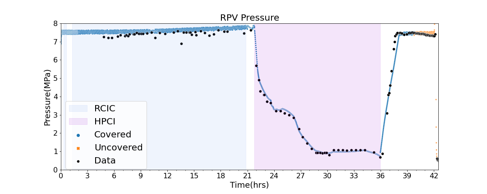
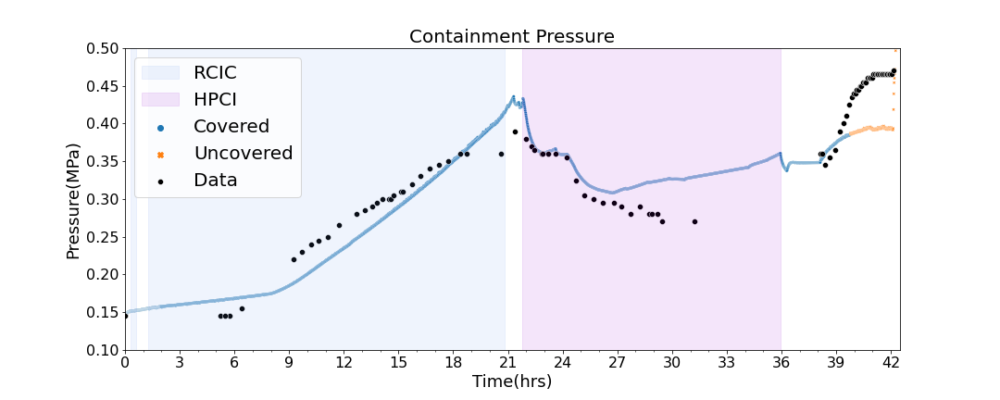
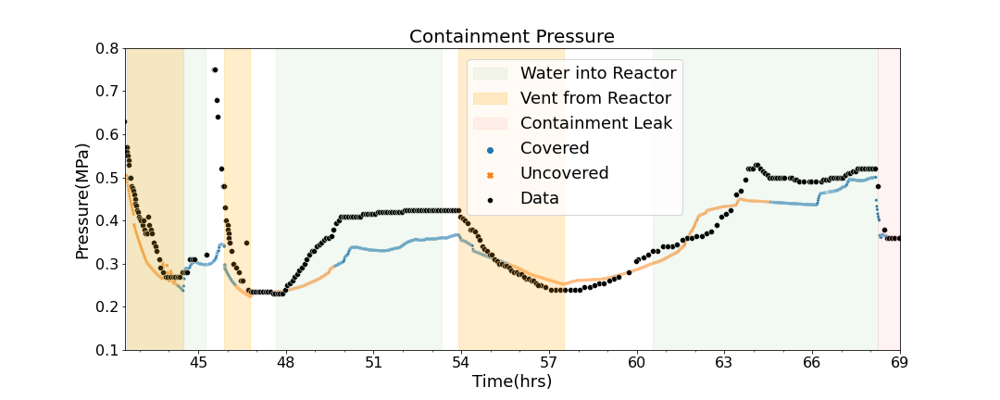
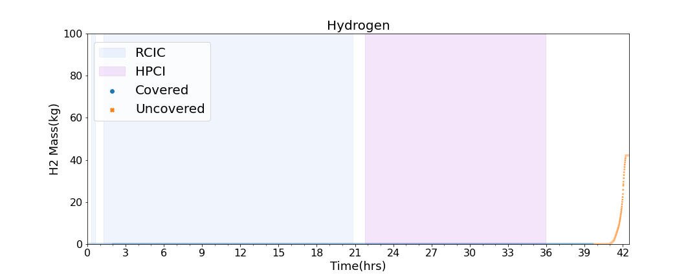
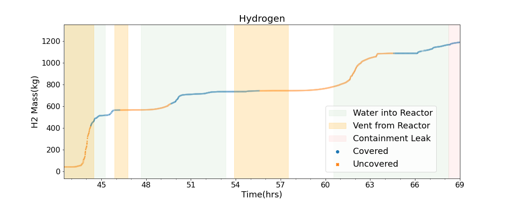

## Visualisation of Fukushima acvcident Analysis

This repository contains an example of using the seaborn package to make visualizations of a complex process, the [Fukushima accident analysis](https://www.psi.ch/en/lrt/scientific-highlights/bsaf-2-analysis-of-unit-3-accident-and-fission-product-transport). The data are not included, however the code could be easily used for similar aplications.

## Authors
[Leticia Fernandez Moguel](https://www.linkedin.com/in/leticia-fernandez-moguel-phd/) 

## RPV Pressure

## DW Pressure

## Hydrogen generation

